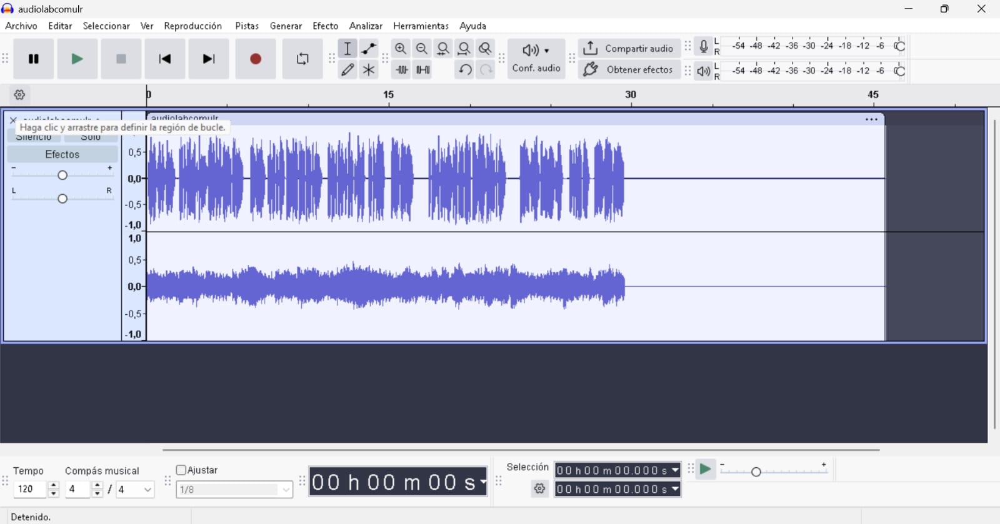
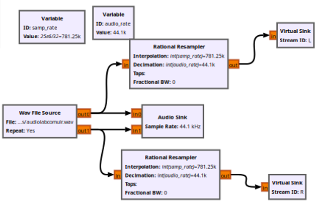
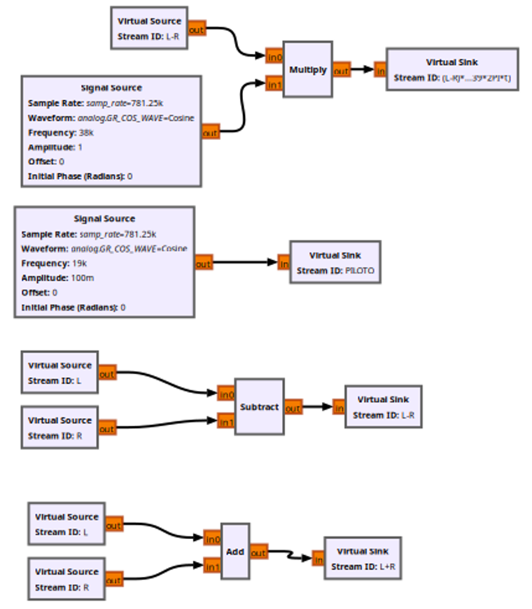
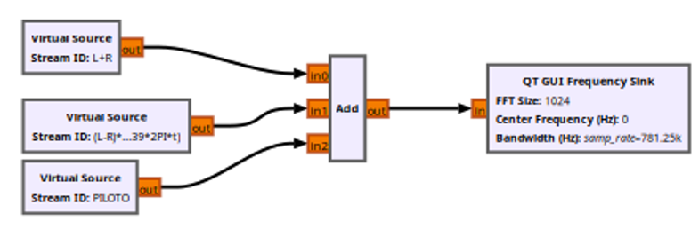
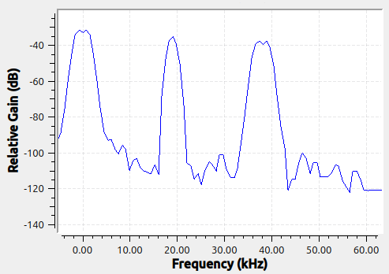
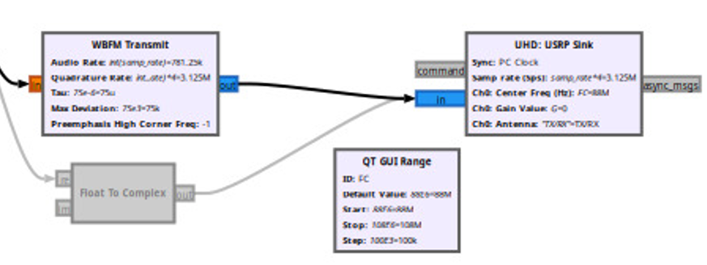
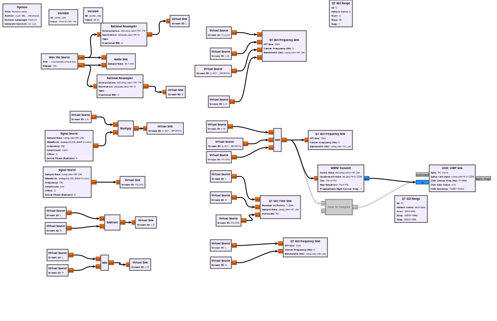
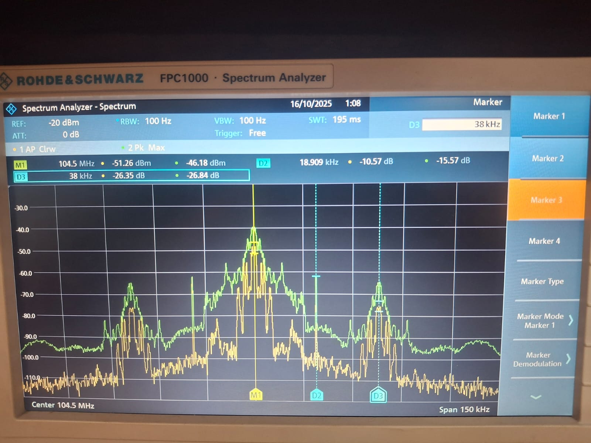

# GNURADIO_LABCOMUIS_2025_2_E1A_G4

# Misión 6: Nuestra Propia Emisora FM Estéreo

## Fase 1 
En esta fase inicial, el enfoque es crear el material sonoro que servirá como contenido para la transmisión.
### Objetivo especifico 1.1: Diseñar un guion para un bloque de programación de 60 a 90 segundos que incluya una introducción (jingle), un segmento de voz y una pieza musical.

**Guion**

Buenas buenas gente, hoy desde la universidad industrial de Santander en Bucaramanga, les saludan Joseph y Juan en el laboratorio de comunicaciones, para todos aquellos que estan escuchando les deseamos un muy buen dia, este mensaje es evidencia del poder de la electronica y las telecomunicaciones, el mundo sigue avanzando mas y mas, no se queden atras y unanse a este mundo **musica**

### Objetivo especifico 1.2: Grabar y/o seleccionar los elementos de audio definidos en el guion.
### Objetivo Específico 1.3: Utilizar un software de edición de audio (ej. Audacity) para ensamblar, mezclar y masterizar los elementos en un único archivo de audio. El producto final debe ser un archivo estéreo (dos canales: Izquierdo y Derecho) en formato .wav para preservar la máxima calidad.
 

## Fase 2

Esta es la fase crítica del procesamiento de la señal, donde se construye la estructura de la señal que modulará la portadora de RF.

### Objetivo Específico 2.1: Cargar el archivo de audio estéreo en el entorno de desarrollo (GNU Radio).
 

 Se carga el archivo separando los audios en L y R, separandolos de tal manera que no sea un audio monofasico

 ### Objetivo Específico 2.2: Implementar los bloques o el código necesario para generar los componentes de la señal MPX:
 - Crear la señal de suma (L+R) para compatibilidad monofónica.
 - Generar el tono piloto de 19 kHz, que es la referencia de fase para la demodulación estéreo.
 - Crear la señal de diferencia (L-R) y modularla en una subportadora de 38 kHz mediante AM de Doble Banda Lateral con Portadora Suprimida (AM-DSB-SC).
   
 ### Objetivo Específico 2.3: Combinar (sumar) las tres señales anteriores para formar la señal MPX final.
   
 ### Objetivo Específico 2.4: Analizar el espectro de la señal MPX resultante y verificar la correcta ubicación y amplitud relativa de cada uno de sus componentes.
 

## Fase 3
En esta fase final, la señal procesada se lleva al dominio de radiofrecuencia para su emisión y se comprueba su correcta recepción.

### Objetivo especifico 3.1: Configurar el bloque de modulación FM, utilizando la señal MPX generada como entrada. Se debe ajustar la desviación de frecuencia para cumplir con el estándar de radiodifusión (típicamente ±75 kHz).
### Objetivo Específico 3.2: Configurar los parámetros del USRP (frecuencia central de transmisión, ganancia, tasa de muestreo) para emitir la señal en una frecuencia libre dentro de la banda FM comercial (88-108 MHz).

### Objetivo especifico 3.3: Iniciar la transmisión y utilizar un receptor de radio FM comercial para sintonizar la señal.
### Objetivo Específico 3.4: Validar cualitativamente la calidad del audio recibido y confirmar que el indicador "Stereo" del receptor se activa, lo que prueba la correcta generación y detección del piloto de 19 kHz.

## Conclusiones
- Se observo la correcta composicion en frecuencia de la señal MPX, la banda L+R (0-15 kHz), el tono piloto en 19 kHz y la banda DSB-SC centrada en 38 kHz correspondiente al componente L-R, confirmando el esquema de multiplexación estereo fue implementadoadecuadamente en GNU Radio. Por lo que la señal MPX generada es apta para ser utilizada como entrada de un modulador FM que seria el encargado de desplazar los componentes mediante variacion de frecuencia alrededor de una portadora de radio.
- Se comprobo que la transmision de la señal MPX modulada en FM presentaba un audio claro y sin distorsiones evidentes, es decir, el desempeño practico del sistema confirma que la señal generada cumple las especificaciones tanto teoricas como cualitativas de calidad.
- La resolucion espectral del FFT depende del tamaño de la ventana y del sample rate, lo que introduce ruido visual, por lo que las amplitudes no se pueden medir con exactitud. Tambien se pueden presentar fugas espectrales en la subportadora debido a imperfecciones en el filtrado, lo que afecta la decodificacion estereo en el receptor.
