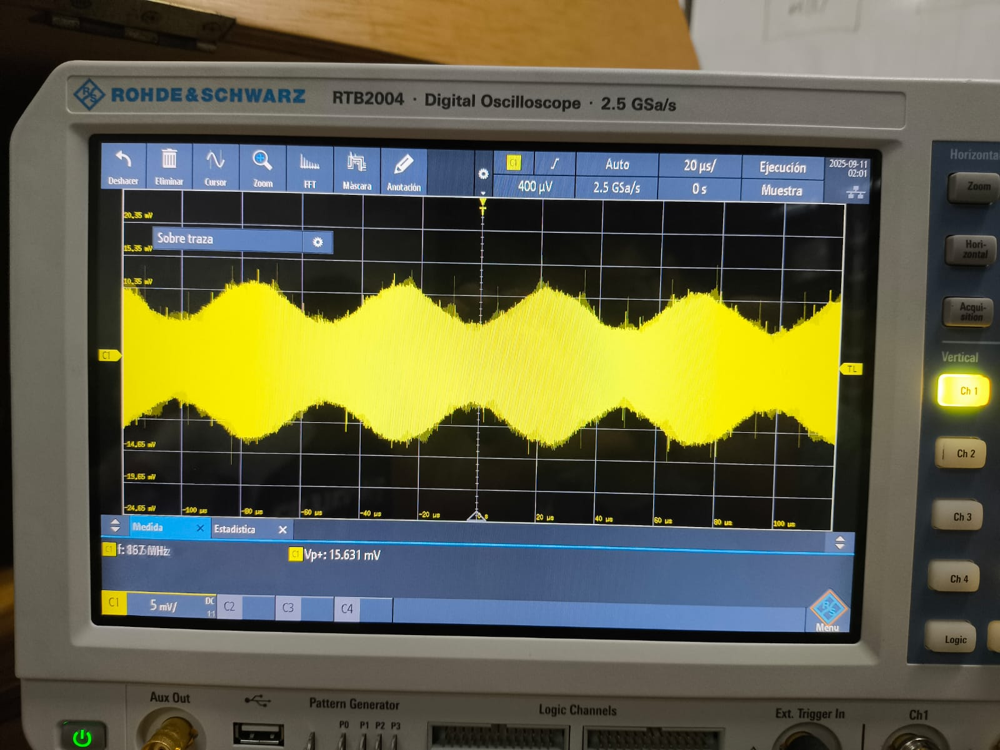
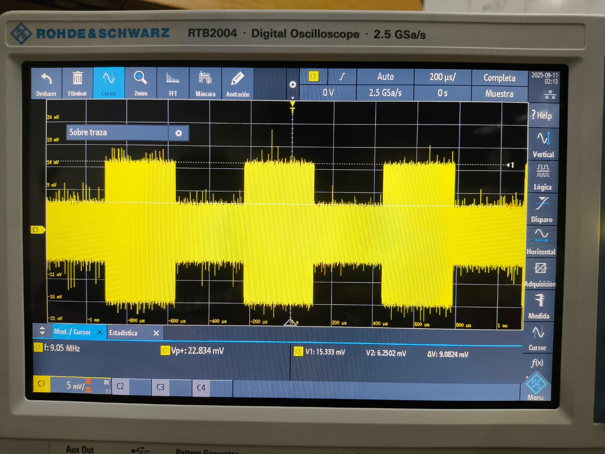
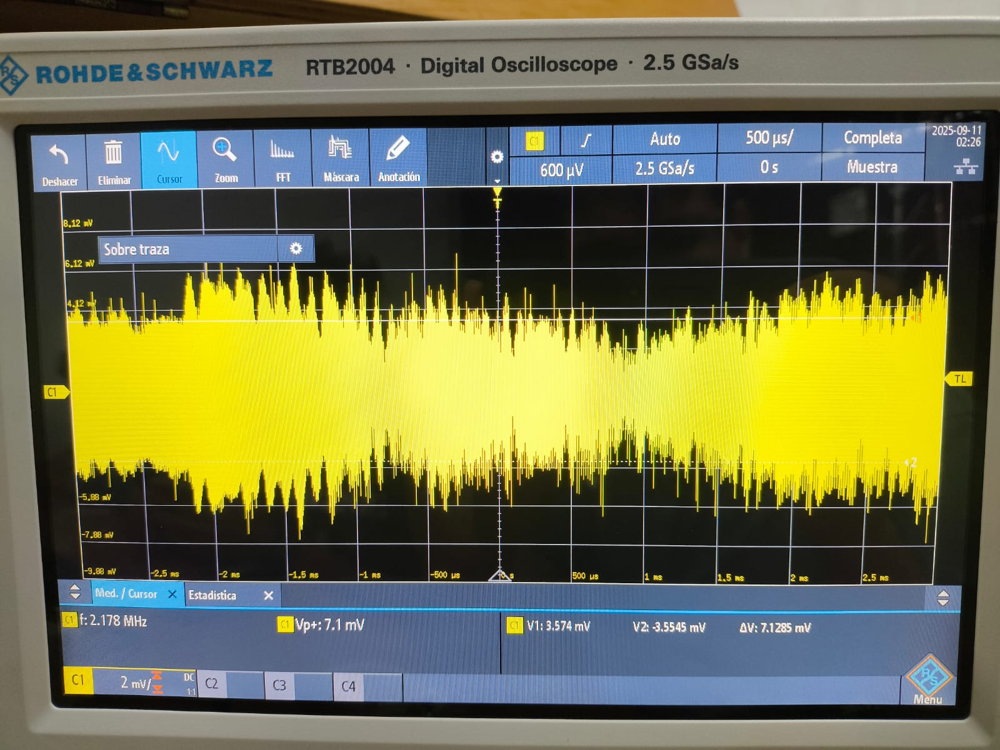
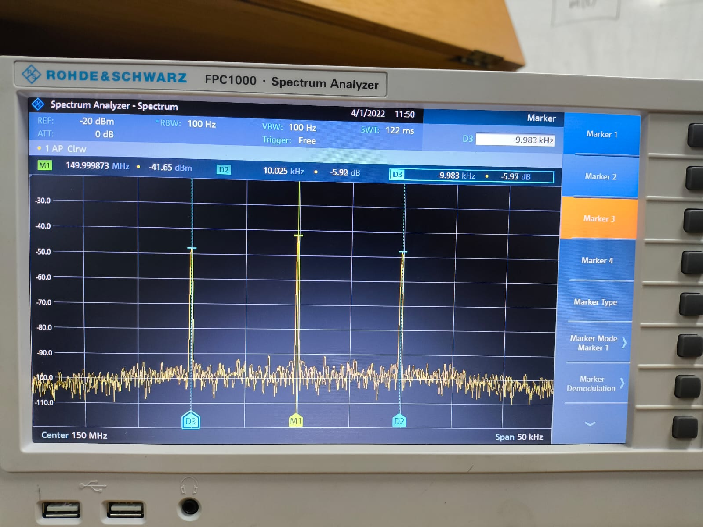
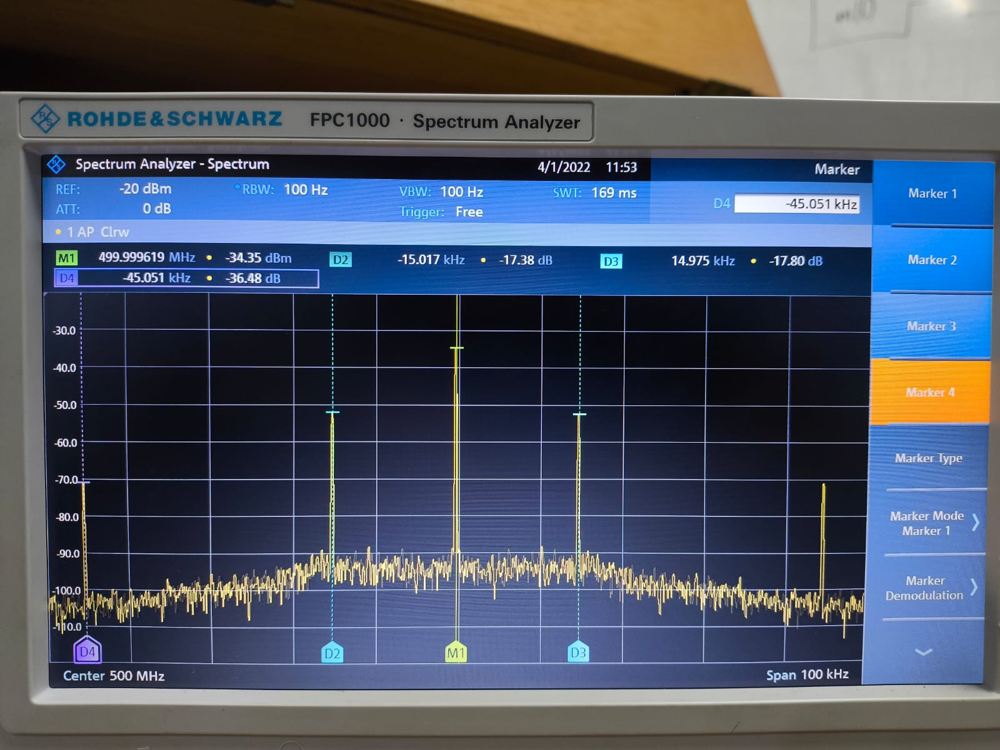
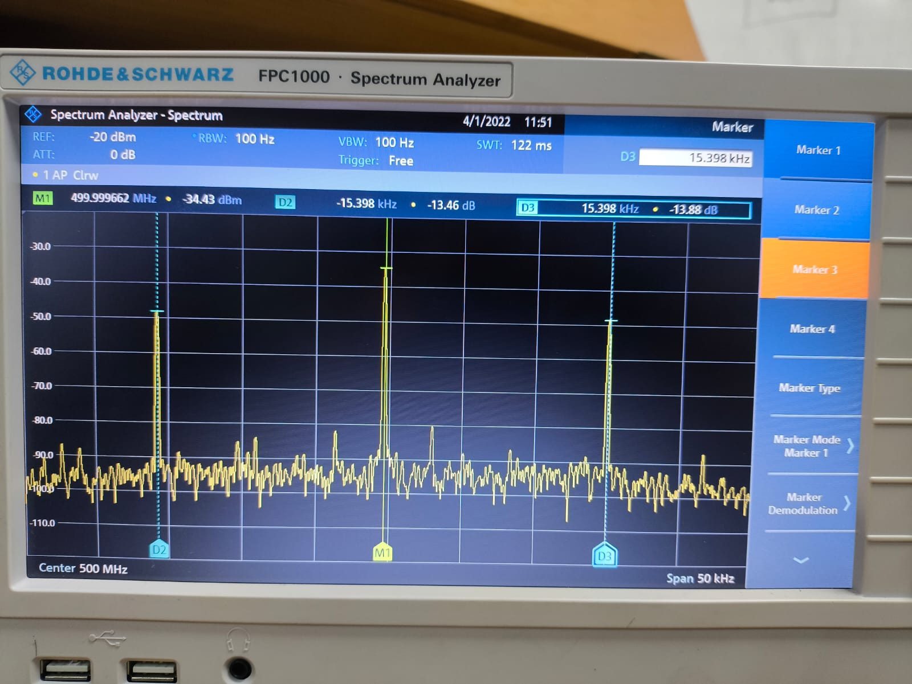
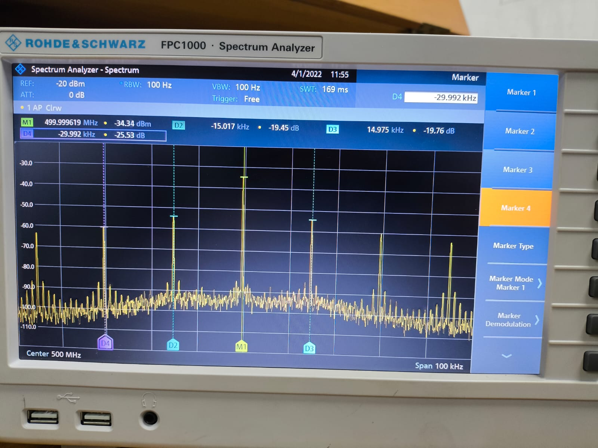
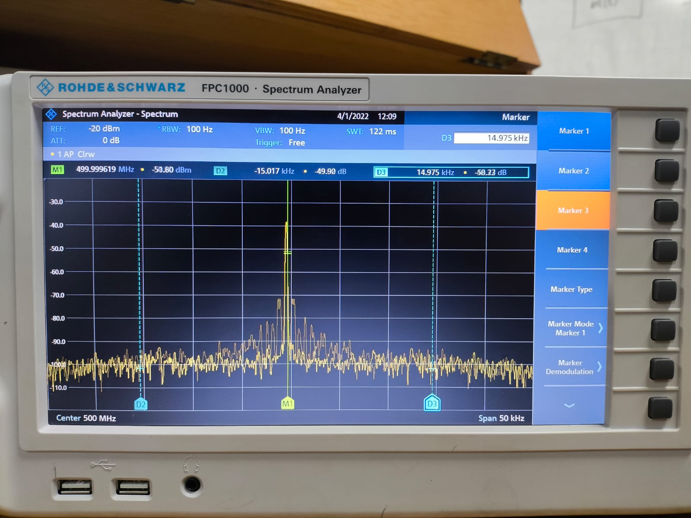

# MISION 3: MODULACIÓN DE ONDA CONTINUA

# Fase 1: Diseño y configuración del modulador (Preparación técnica)

 Frecuencia de la Portadora: 433 MHz

 Tasa de Muestreo (Sample Rate): 12.5 MS/s

 Ganancia de Transmisión (TX Gain): 0 dB, para evitar daños en el puerto de entrada del osciloscopio o el analizador de espectro.
# Fase 2: Generación y Medición

   Conexión Segura: Conecte la salida de transmisión (TX1 / RX1) de su SDR al atenuador, y la salida del atenuador a la entrada del canal 1 del osciloscopio. Nota: recuerde que la amplitud maxima de la envolvente compleja debe ser menor a 0.5

  Señal senoidal:
  

  Señal senoidal con ganancia K de 1 a 1kHz de frecuencia.

   Señal cuadrada:
  

  Señal cuadrada con ganancia K de 1 a 1kHz de frecuencia.

   Señal de audio:
  

  Se utilizo una señal de audio de una canción.
 
  # Fase 3: Análisis de Espectro y Comparación
### Tabla Comparativa de Señales Moduladoras

| Tipo de Señal Moduladora | Analizador de espectro | Descripción tecnica | Efecto de la Modulación |
|--------------------------|--------------------------|------------------------------------------------|--------------------------|
| Senoidal                |  |Señal con frecuencia central de 150MHz con 2 bandas laterales en el espectro simetricas separadas ±10kHz de la portadora, siendo esta la de mayor potencia  | La modulacion AM es la que genera la aparicon de las bandas laterales, estas bandas laterales representan la información modulada y aumentan el ancho de banda de la señal. |
| Cuadrada                |  |Señal con frecuencia central de 500MHz se observan bandas laterales en los armonicos impares de la señal cuadrada. Las primeras bandas laterales ocurren a ±15kHz respecto a la portadora  | La modulación AM con una señal cuadrada genera múltiples bandas laterales, ya que la onda cuadrada contiene una serie de armónicos impares. Cada armónico produce sus propias bandas alrededor de la portadora, ensanchando el espectro significativamente.  |
| Triangular              |  |  |  |
| Diente de sierra        |  |  |  |
| Audio          |  |  |  |

